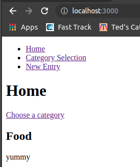
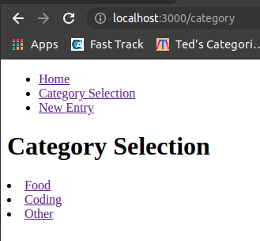
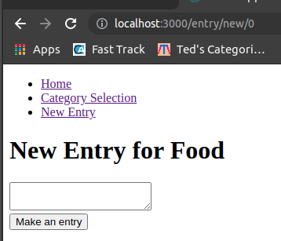

# Simple Journal app
# Lesson plan

- React Router
- How is react router different from normal routes
- BrowserRouter: is the root routing component that keeps your UI in sync with URL and Route.
- Route: is responsible for rendering a component in your app when the URL matches its path.
- Exact: matches exact path
- Switch: will inly render the first Route that matches the URL
- Navigation: Link
- Populate the app:
- history and redirect

https://reactrouter.com/web/guides/quick-start
https://reactrouter.com/web/api/withRouter


1. Create empty react app using template:
	- yarn create react-app journal_app --template basic-empty
	- cd journal app
	- yarn start
2. npm install react-router-dom

## Result





## <mark>Explanation</mark>
- Syntax:
```js
<Route exact path="/" component={Home} />
//same as
<Route exact path="/">
	<Home />
</Route>
//However, in this case, we use render instead to avoid the unmounting and mounting behaviour
 ```
 Read more: https://betterprogramming.pub/react-router-whats-the-difference-between-components-and-routes-d242f41b111d
 - Switch
 	- you should put `<Route>` s with more specific (typically longer) paths before less-specific ones.
 	- If no `<Route>` matches, the `<Switch>` renders nothing (null)
- Navigation - Link
	 - Wherever you render a `<Link>`, an anchor (`<a>`) will be rendered in your HTML document. 
	 - The `<NavLink>` is a special type of `<Link>` that can style itself as “active” when its to prop matches the current location.
```
<Link to="/">Home</Link>
// <a href="/">Home</a>
```
```
<NavLink to="/react" activeClassName="hurray">
  
</NavLink>

// When the URL is /react, this renders:
// <a href="/react" className="hurray">React</a>

// When it's something else:
// <a href="/react">React</a>
```
Any time that you want to force navigation, you can render a <Redirect>. When a <Redirect> renders, it will navigate using its to prop.
```
<Redirect to="/login" />
```

App.js
```js
import React, {useState} from 'react'
import {BrowserRouter as Router, Switch, Route, Link} from 'react-router-dom'
import Home from './components/Home'
import CategorySelection from './components/CategorySelection'
import NewEntry from './components/NewEntry'
import NotFound from './components/NotFound'


const App = () => {
  const defaultCategories = ["Food", "Coding", "Other"]
  const[categories, setCategories] = useState(defaultCategories)
  const [entries, setEntries] = useState([]) 
      //we use an array here to keep a copy of existing data, just add new value to it

  //whenever dealing with an array or object, never update state directly, always take a copy
  function addEntryToJournal(newEntry) {
    const updatedEntries = [...entries, newEntry]
      //(...) Spread syntax can be used when all elements from an object or array need to be included in a list of some kind. 
      //insert new item at the end
    setEntries(updatedEntries)
  }

  return (
    <div >
      {/* Router tag at root level */}
      <Router> 
        <ul>
          <li><Link to='/'>Home</Link></li>
          <li><Link to='/category'>Category Selection</Link></li>
          <li><Link to='/entry/new/:id'>New Entry</Link></li>
        </ul>
        
        <Switch>
          <Route exact path='/' render={(props) => <Home {...props} entries={entries} /> } />
          <Route path='/category' render={(props) => <CategorySelection {...props} categories={categories}/>} />
          <Route path='/entry/new/:id' render={(props) => <NewEntry {...props} categories={categories} addEntryToJournal={addEntryToJournal}/>} />
          <Route component={NotFound}/>
        </Switch>
      </Router>
    </div>
  )
}
export default App

```

components/Home.js
```js
import React from "react";
import {Link} from 'react-router-dom'

const Home = ({entries}) => {
  console.log(entries)
  return (
    <div>
      <h1>Home</h1>
      <Link to='/category'>Choose a category</Link>
      {entries.map((entry, index) => {
        return (
          <div key={index}>
            <h2>{entry.category}</h2>
            <p>{entry.entry}</p>
          </div>
        )
      })}
    </div>
  );
};

export default Home;
```

components/NewEntry.js
```js
import React, {useState, useEffect} from "react" 
import EntryForm from './EntryForm'

const NewEntry = ({match, categories, addEntryToJournal}) => {
        // console.log(match) => we can access the URL id {...params: {id: "0", path: "/entry/new/:id", url: "/entry/new/0"}...}
        // console.log(categories) => ["Food", "Coding", "Other"]
    const selectedCategory = match.params ? match.params.id : -1
    const category = categories[selectedCategory]
        // console.log(category) => check if we have the right result
    const [errorMsg, setErrorMsg] = useState(null)

    // we need to useEffect to control re-render, only when input change, does the setErrorMsg work
    // or else it falls to an infinite loop
    useEffect(() => {
        category ? setErrorMsg(null) : setErrorMsg("Category not found, please try another link")
    }, [categories, category])

    return (
        <div>
            <h1> New Entry for {category}</h1>
            {errorMsg && <p>{errorMsg}</p>}
            {category && <EntryForm category={category} addEntryToJournal={addEntryToJournal}/>}
        </div>
    )
}
export default NewEntry
```
components/EntryForm.js
```js
import React, {useState} from "react";
import { withRouter } from "react-router";

const EntryForm = ({addEntryToJournal, category, history}) => {
  const [entry, setEntry] = useState("")
  console.log(history)

  function onTextChange(event) {
    // console.log(event.target.value)
    setEntry(event.target.value)
  }
  function handleSubmit(event){
    event.preventDefault()
    if (entry && entry.length>0) {
      // console.log("handleSubmit", {category, entry})
      addEntryToJournal({category, entry})
      return history.push("/") //automatic redirected to the homepage
    }
  }

  return (
    <div>
      <form onSubmit={handleSubmit} >
        <div>
          <textarea onChange={onTextChange}></textarea>
        </div>
        <input type='submit' value='Make an entry'/>
      </form>
    </div>
  );
};

export default withRouter(EntryForm);
```
components/NotFound.js
```js
import React from "react"

const NotFound = () => {
	return (
		<h1> opps page not found, please try another URL </h1>
	)
}

export default NotFound
```